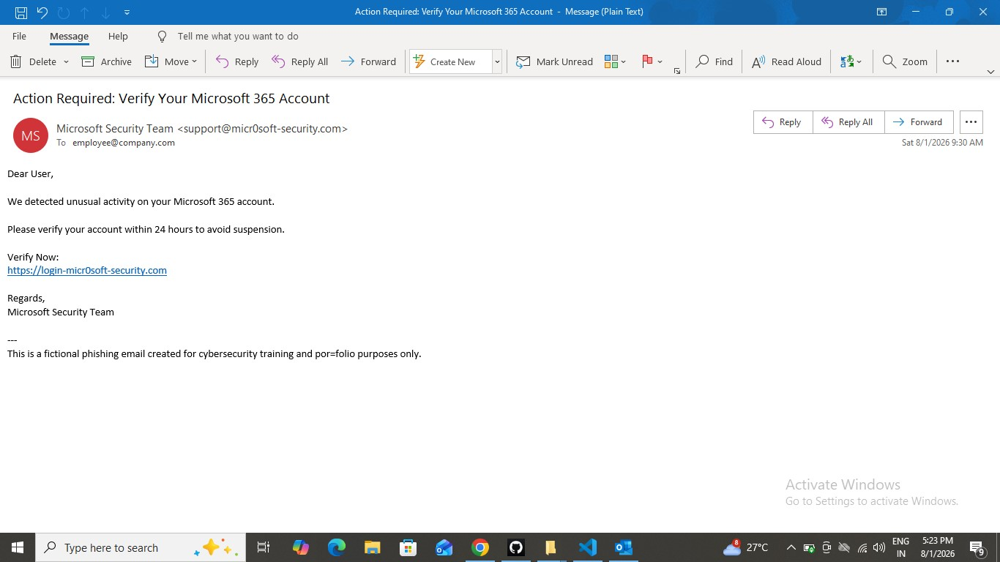
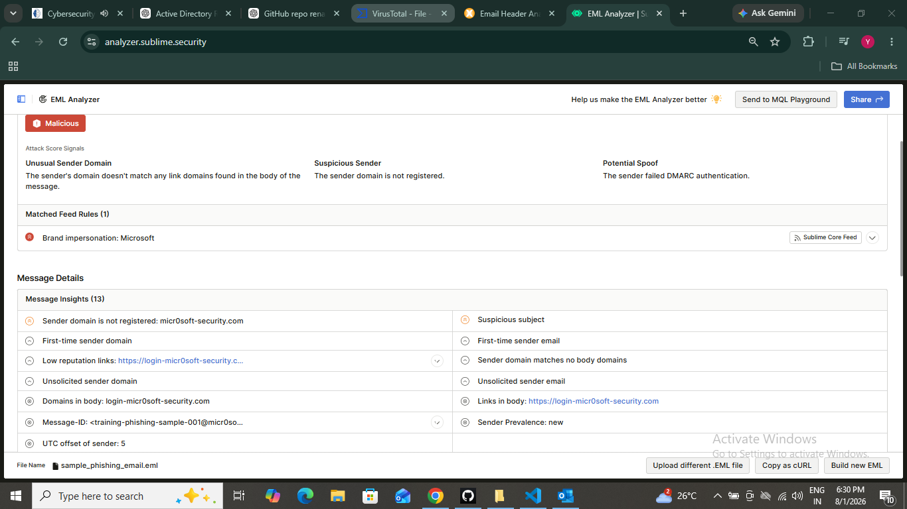
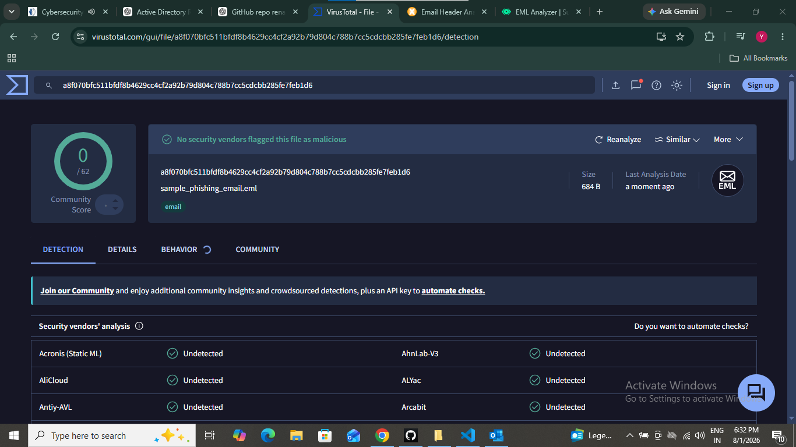
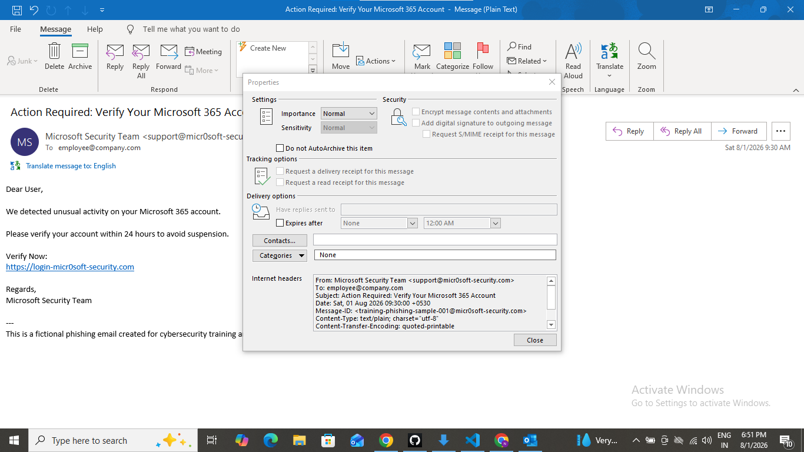

# 📧 Phishing Email Investigation

## 📌 Objective

The objective of this project is to investigate a suspicious phishing email, identify phishing indicators, analyze the email, document the findings, and recommend mitigation actions.

---

# 📖 Scenario

A user reported a suspicious email claiming to be from **Microsoft 365**.

The email requested the user to verify their account through a login link.

As a SOC Analyst, I investigated the email to determine whether it was a phishing attempt.

---

# 📂 Evidence Collected

- Sample phishing email (.eml)
- Sender email address
- Subject line
- Email body
- Suspicious URL

---

# 📧 Sample Email

```text
From: Microsoft Security Team <support@micr0soft-security.com>
To: employee@company.com
Subject: Action Required: Verify Your Microsoft 365 Account

Dear User,

We detected unusual activity on your Microsoft 365 account.

Please verify your account within 24 hours to avoid suspension.

Verify Now:
https://login-micr0soft-security.com

Regards,
Microsoft Security Team
```

### Phishing Email



---

# 🔍 Investigation Steps

## Step 1 – Verify Sender

### Sender

```text
support@micr0soft-security.com
```

### Analysis

| Official Microsoft Domain | Received Domain |
|---------------------------|----------------|
| microsoft.com | micr0soft-security.com |

### Findings

- The sender domain contains **"0" (zero)** instead of **"o"**.
- The domain is **not owned by Microsoft**.
- This is a common **domain spoofing** technique.

**Result:** ⚠️ Suspicious

---

## Step 2 – Analyze Subject

### Subject

```text
Action Required: Verify Your Microsoft 365 Account
```

### Findings

- Uses urgent language.
- Encourages immediate action.
- Creates fear of account suspension.

**Result:** ⚠️ Suspicious


### EML Analyzer



---

## Step 3 – Analyze Email Body

### Observations

- Claims unusual account activity.
- Requests account verification.
- Gives a 24-hour deadline.
- Warns about account suspension.

### Findings

The attacker is using **social engineering** to pressure the recipient into clicking the link.

**Result:** ⚠️ Suspicious

---

## Step 4 – Analyze URL

### URL Found

```text
https://login-micr0soft-security.com
```

### Analysis

| Official URL | Suspicious URL |
|--------------|----------------|
| https://login.microsoftonline.com | https://login-micr0soft-security.com |


### VirusTotal Analysis



### Findings

- Uses a fake Microsoft domain.
- Designed to steal user credentials.
- Not an official Microsoft login page.

**Result:** 🚨 Fake Login Page

---

## Step 5 – Analyze Email Header

### Header Fields Checked

- From
- Return-Path
- Reply-To
- Message-ID

### Findings

- Sender domain does not match Microsoft's official domain.
- Header information indicates possible spoofing.

**Result:** ⚠️ Possible Email Spoofing

### Email Header




---

## Step 6 – Indicators of Compromise (IOCs)

| IOC Type | Value |
|----------|-------|
| Sender Email | support@micr0soft-security.com |
| Domain | micr0soft-security.com |
| URL | https://login-micr0soft-security.com |

---

## Step 7 – MITRE ATT&CK Mapping

| Tactic | Technique |
|---------|-----------|
| Initial Access | Phishing (T1566) |
| Credential Access | Credential Harvesting |

---

## Step 8 – Recommended Actions

- Block the sender email address.
- Block the malicious domain.
- Block the malicious URL.
- Notify affected users.
- Update email filtering rules.
- Reset passwords if credentials were entered.
- Monitor for similar phishing attempts.

---

## Step 9 – Conclusion

The investigation confirmed that the email is a **phishing attempt**.

### Indicators Identified

- ✅ Spoofed sender domain
- ✅ Fake Microsoft login URL
- ✅ Urgent language
- ✅ Social engineering
- ✅ Credential harvesting attempt

Based on the investigation, the email was classified as **Malicious (Phishing)**.

---

# 🛠️ Skills Demonstrated

- Email Security
- Phishing Analysis
- Email Header Analysis
- IOC Identification
- MITRE ATT&CK Mapping
- Threat Analysis
- Incident Investigation
- SOC Analyst Workflow

---

# 📚 Tools Used

| Tool | Purpose |
|------|---------|
| VS Code | Documentation |
| Microsoft Outlook / Thunderbird | Open `.eml` file |
| VirusTotal | URL / File Reputation (Optional) |
| Splunk | IOC Search (Optional) |

---

